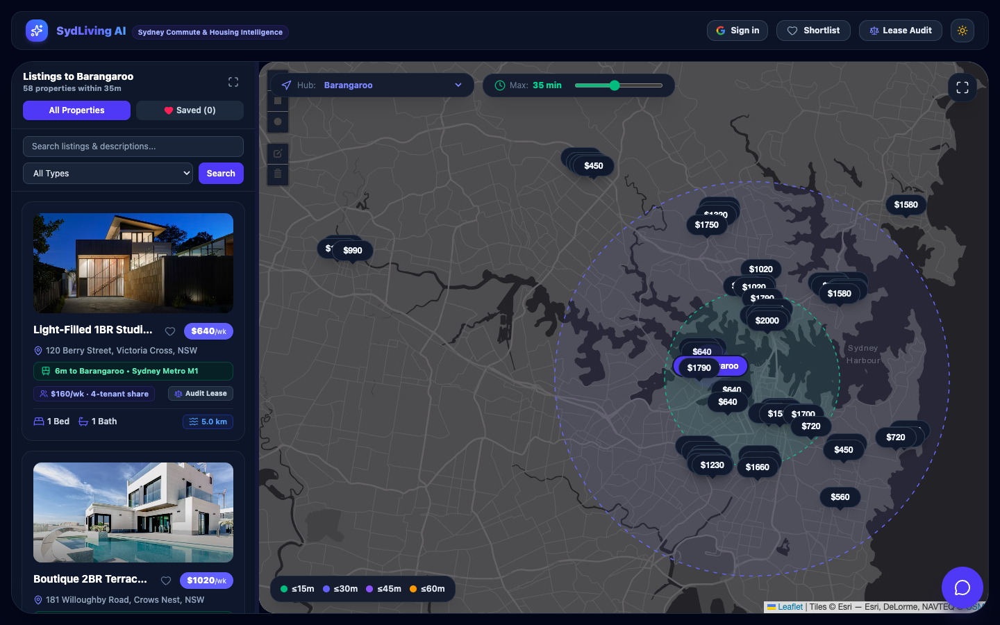
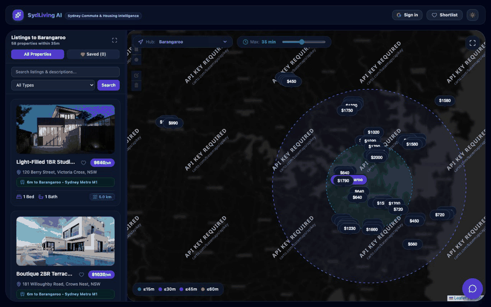
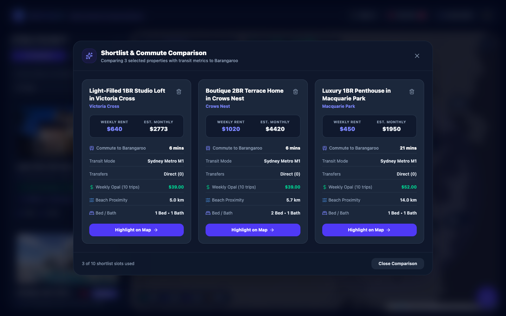
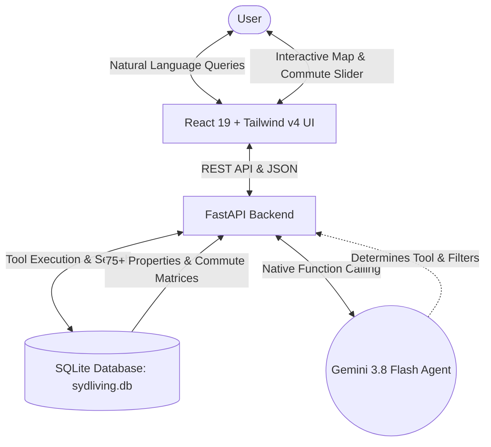

# SydLiving AI

[](https://fastapi.tiangolo.com)
[](https://react.dev)
[](https://www.typescriptlang.org)
[](https://tailwindcss.com)
[](https://ai.google.dev)
[](https://leafletjs.com)
[](https://opensource.org/licenses/MIT)

**SydLiving AI** is an AI-augmented property search and commute intelligence platform tailored for professionals, students, and expats relocating to Sydney, Australia.

Moving to Sydney often means balancing high rental costs against long, complex public transit commutes across Sydney Harbour, the Eastern Suburbs, and Greater Western Sydney. SydLiving AI demystifies Sydney housing by unifying **natural language property discovery**, **Transport for NSW (TfNSW) door-to-door transit matrices**, **interactive spatial commute reach isochrones**, and a **side-by-side shortlist comparison suite** in a single glassmorphic workspace.

---



---

## 🌟 Key Features

### 1. Dynamic Commute Reach & Multi-Tier Isochrones
Filter properties by door-to-door transit commute travel time to major Sydney employment hubs (Barangaroo, Central, Martin Place, Victoria Cross / North Sydney, Macquarie Park, and Parramatta).

- **Multi-Tier Reach Zones:** Visual isochrone rings dynamically render on the map for $\le$15m (green), $\le$30m (indigo), $\le$45m (purple), and $\le$60m (amber).
- **Transit Mode Transparency:** Every listing card displays verified door-to-door transit times, line details (Sydney Metro M1, Sydney Trains T1/T4, B-Line Express Buses, Sydney Ferries), and direct transfer indicators.
- **Interactive Commute Slider:** Drag the maximum commute slider to instantly filter matching properties and update map reach zones in real time.



---

### 2. Shortlist & Side-by-Side Commute Comparison
Compare shortlisted properties side-by-side to make confident rental decisions.

- **Financial Clarity:** View weekly rent paired with estimated monthly housing expenses.
- **Door-to-Door Commute Breakdown:** Compare travel minutes and transit lines to your selected workplace hub.
- **Opal Fare Projections:** Estimated weekly transit costs based on a standard 10-trip weekly commute.
- **Lifestyle Metrics:** Proximity to Sydney beaches (Bondi, Manly, Coogee, Bronte) and direct route transfers.
- **Map Synchronization:** Jump directly from the comparison modal to highlight any property on the interactive map.



---

### 3. Conversational AI Relocation Assistant
Powered by **Google Gemini 3.8 Flash** with native function calling, the assistant consults on Sydney suburbs, rent affordability, and public transit connectivity.

- **Tool Execution:** Automatically calls backend tools (`query_properties`, `get_commute`, `filter_by_commute_reach`) to query listings and transit matrices.
- **Live UI Synchronization:** AI recommendations immediately update map bounds, active hub filters, and listing results.
- **Curated Prompt Suggestions:** One-tap chips for newcomer queries like *"Show rentals under 25 mins to Barangaroo"*, *"Metro-connected 2BR under $850/wk"*, and *"Compare commute from Manly vs Bondi Beach"*.

---

## 🏗️ Architecture

SydLiving AI is architected as a local-first, full-stack platform:

- **Backend:** FastAPI (Python 3.11+), Pydantic v2
- **Database:** SQLite (local database: `sydliving.db` with spatial coordinates & commute matrices)
- **Frontend:** React 19, Vite, TypeScript, Tailwind CSS v4, Lucide Icons, React-Leaflet
- **AI Agent:** Google Gemini (`gemini-3.8-flash`) with function calling and multi-turn chat sessions



---

## 🚀 Development Setup

### Prerequisites
- Python 3.11+ (or Python 3.9+)
- Node.js (v18+ recommended)
- Git

### 1. Database Setup & Data Seeding
Before launching the backend, generate the SQLite database and seed it with Sydney destination hubs, property listings, and transit commute matrices.

```bash
cd backend

# Create and activate virtual environment
python3 -m venv venv
source venv/bin/activate

# Install backend dependencies
pip install -r requirements.txt

# Seed the database
python3 seed.py
```
*Creates `sydliving.db` containing 6 destination hubs, 75 mock property listings with Unsplash photos, and door-to-door commute matrices.*

### 2. Environment Configuration
Create a `.env` file in `backend/`:

```env
# Google Gemini API Key for conversational AI agent
GEMINI_API_KEY=your_gemini_api_key_here
GEMINI_MODEL=gemini-3.8-flash

# Optional: Domain Group API Key & Google Places API Key
DOMAIN_API_KEY=
GOOGLE_API_KEY=
```

### 3. Run FastAPI Backend

```bash
cd backend
uvicorn main:app --reload --port 8000
```
- API Base: `http://localhost:8000`
- Interactive Swagger Docs: `http://localhost:8000/docs`

### 4. Run React + Vite Frontend

```bash
cd frontend

# Install dependencies
npm install

# Start Vite dev server
npm run dev
```
The frontend application will be live at `http://localhost:5173`.

---

## 📡 API Endpoints Reference

| Method | Endpoint | Description |
|---|---|---|
| `GET` | `/api/health` | Service health check |
| `GET` | `/api/hubs` | Retrieve all Sydney destination CBD hubs |
| `GET` | `/api/properties` | Search properties with filters: `destination_hub`, `max_commute_mins`, `max_rent`, `min_bedrooms`, `circle`, `polygon` |
| `GET` | `/api/commute` | Lookup transit duration and route between `origin_suburb` and `destination_cbd_hub` |
| `GET` | `/api/isochrones` | Commute reach suburbs within `max_minutes` of a `destination_hub` |
| `POST` | `/api/chat` | Multi-turn conversational endpoint invoking Gemini agent with tool calling |
| `GET` | `/api/chat/sessions` | Fetch conversation history for authenticated user |
| `GET` | `/api/properties/saved` | Fetch saved/shortlisted properties |
| `POST` | `/api/properties/saved/{id}` | Toggle saved property |

---

## 🧪 Testing

Run backend automated test suite:

```bash
cd backend
pytest
```

Run frontend linting & production build:

```bash
cd frontend
npm run build
```

---

## 📄 License
MIT License. Created for professionals relocating to Sydney, Australia.
