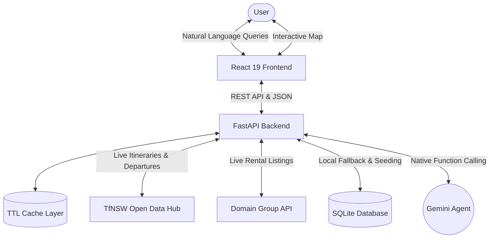

# SydLiving AI

SydLiving AI is an AI-augmented property search and commute analysis platform tailored for professionals relocating to Sydney, Australia.

The platform unifies natural language property discovery with live Transport for NSW (TfNSW) transit data and Domain Group rental listings to calculate real door-to-door commute times and lifestyle metrics.

## Architecture

This project is built as a modern full-stack web application with live API integrations and caching:
- **Backend:** FastAPI (Python 3.11+), Pydantic v2
- **External Real-Time APIs:**
  - **Transport for NSW (TfNSW) Open Data Hub:** Trip Planner API (`/stop_finder`, `/trip`, `/departure_mon` endpoints) for real door-to-door journey itineraries, transfer counts, and live departures.
  - **Domain Group Developer API:** "Agencies & Listings" and "Properties & Locations" packages for authentic Sydney rental listings and suburb suggestions.
- **Caching Layer:** High-performance thread-safe TTL Cache (`backend/cache.py`) preventing duplicate external API calls with hit-rate monitoring.
- **Database:** SQLite local fallback (`sydliving.db`), migration ready for DynamoDB.
- **Frontend:** React 19, Vite, TypeScript, Tailwind CSS, React-Leaflet
- **AI Agent:** Google Gemini Pro / Flash Native Tool Calling



### Core Features
1. **Live Commute Calculation (TfNSW Trip Planner):** Door-to-door journey calculation with transit modes (Train, Metro, Bus, Ferry, Light Rail), transfer counts, and real-time station departures.
2. **Domain Rental Search:** Filter live Sydney rentals by suburb, maximum weekly rent, and minimum bedrooms.
3. **Resilient TTL Caching:** Automated 30-min transit route caching, 60-min property listing caching, and 5-min station departure caching.
4. **Semantic "Vibe" Search (Phase 2):** Vector cosine similarity matching over listing descriptions and neighborhood vibe profiles (e.g. "quiet, leafy, near good coffee", "beachside haven", "bustling nightlife").
5. **Multi-Option Trade-Off Engine (Phase 2):** Agent returns 2–3 clearly labelled trade-offs (🏷️ Cheapest, ⏱️ Fastest Commute, ⭐ Best Overall) allowing users to balance budget against commute friction.
6. **Session Preference Persistence (Phase 2):** In-memory thread-safe session store maintaining constraints (budget, bedrooms, target hub, vibe tags) across multi-turn conversations without re-prompting.
7. **AWS Lease & Inspection Auditor (Phase 3):** Serverless lease analysis extracting text and key facts with **AWS Textract**, running entity extraction with **AWS Comprehend**, and executing a specialized NSW Tenancy Red Flag Rule Engine (detecting illegal bond ratios >4wks, missing Rental Bonds Online lodgement, unlawful break-lease penalties, and 6-month rent reviews).
8. **AWS Step Functions Search Orchestration (Phase 3):** Decoupled multi-step workflow defined in Amazon States Language (`backend/statemachine/property_orchestrator.asl.json`) orchestrating: Search Listings ➔ Calculate Commutes ➔ Score Lifestyle & Vibe ➔ Synthesize Trade-offs.
9. **Shortlist Favorites & Instant Alerts (Phase 4):** Save preferred listings to an interactive shortlist drawer and subscribe for email alerts on newly matching Sydney rental properties with custom frequency and rent thresholds.
10. **Commute-Cost Heatmap Layer (Phase 4):** Interactive Leaflet spatial layer plotting Sydney suburbs classified by commute time to CBD hubs (Wynyard, Central, Town Hall, Martin Place) vs. median weekly rent across distinct affordability/commute efficiency tiers.
11. **Interactive Coastal Glassmorphic Dashboard:** Split-screen UI featuring React-Leaflet map view with heatmap toggle, resizable panels, trade-off cards, shortlist drawer, alert modal, interactive lease audit modal, and conversational AI chat assistant.

---

## Development Setup

### Prerequisites
- Python 3.11+
- Node.js (v18+ recommended)
- Git

### Environment Variables
Configure `.env` in `backend/`:
```env
# Gemini API Key for AI Agent
GEMINI_API_KEY=your_gemini_api_key

# Transport for NSW Open Data Hub API Key (Optional: Graceful fallback active when absent)
TFNSW_API_KEY=your_tfnsw_api_key

# Domain Group Developer API Key (Optional: Graceful fallback active when absent)
DOMAIN_API_KEY=your_domain_api_key

# AWS Credentials (Optional: Local fallback active when absent)
AWS_ACCESS_KEY_ID=your_aws_access_key
AWS_SECRET_ACCESS_KEY=your_aws_secret_key
AWS_REGION=ap-southeast-2
PROPERTY_ORCHESTRATOR_SFN_ARN=arn:aws:states:ap-southeast-2:123456789012:stateMachine:SydLivingOrchestrator
```

### 1. Database Setup & Data Seeding
Generate the SQLite database and seed initial Sydney properties:

```bash
cd backend
python3 seed.py
```

### 2. Backend Setup (FastAPI)

```bash
cd backend

# Create and activate virtual environment
python3 -m venv venv
source venv/bin/activate

# Install dependencies
pip install -r requirements.txt

# Run backend test suite
pytest tests -v

# Run the development server
uvicorn main:app --reload
```
The API will be available at `http://localhost:8000`. Interactive docs at `http://localhost:8000/docs`.

### API Endpoints
- `GET /api/properties`: Search properties via Domain API with caching. Params: `suburbs` (list of strings), `max_rent` (float), `min_bedrooms` (int).
- `POST /api/properties/semantic-search`: Search rentals using vector similarity over listing copy and suburb vibe metadata.
- `GET /api/commute`: Calculate door-to-door transit via TfNSW Trip Planner. Params: `origin_suburb` (string), `destination_cbd_hub` (string).
- `GET /api/departures`: Real-time upcoming departures via TfNSW Departures API. Params: `stop_query` (string).
- `GET /api/locations/suggest`: Suburb and address suggestions via Domain Properties & Locations. Params: `terms` (string).
- `GET /api/session/preferences`: Retrieve active session preferences. Param: `session_id`.
- `DELETE /api/session/preferences`: Clear stored session preferences. Param: `session_id`.
- `POST /api/lease/audit`: Upload lease PDF or paste agreement clauses for AWS Textract/Comprehend NSW statutory red flag analysis.
- `POST /api/orchestrator/search`: Execute Step Functions orchestrated 4-step search pipeline.
- `GET /api/favorites`: Retrieve user's shortlisted favorite properties. Param: `user_id`.
- `POST /api/favorites`: Add property to shortlist. Body: `{ "user_id": str, "property_id": str }`.
- `DELETE /api/favorites/{property_id}`: Remove property from shortlist. Param: `user_id`.
- `POST /api/alerts`: Register email alert subscription for matching rental listings.
- `GET /api/alerts`: List active alert subscriptions. Param: `email` (optional).
- `GET /api/heatmap`: Generate suburb commute-cost efficiency metrics ($/wk vs mins to CBD). Params: `destination_hub`, `max_commute_mins`.
- `GET /api/cache/stats`: Live cache hits, misses, and active entry metrics.
- `POST /api/cache/clear`: Invalidate all in-memory caches.
- `POST /api/chat`: Process natural language relocation queries via Gemini agent, maintaining session preferences and returning 2–3 labelled trade-off options.

### 3. Frontend Setup (React + Vite)

```bash
cd frontend

# Install dependencies
npm install

# Run the development server
npm run dev
```
The frontend application will be accessible at `http://localhost:5173`.

---

## Testing & Documentation Standards
This project follows an iterative development cycle. **Every iteration includes:**
- Relevant updates to `README.md`, `DESIGN.md`, and `PRODUCT.md`.
- Automated tests (`pytest` for backend) for newly introduced logic.
- Inline documentation and docstrings for major functions and components.

## License
MIT License
