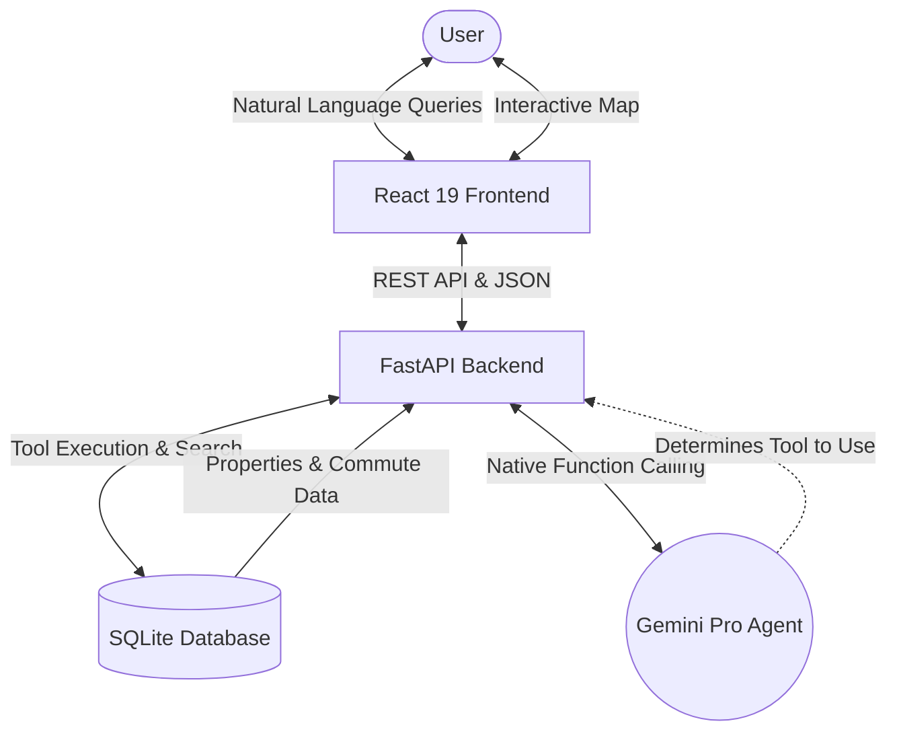

# SydLiving AI

SydLiving AI is an AI-augmented property search and commute analysis platform tailored for professionals relocating to Sydney, Australia.

The platform allows users to query Sydney sharehouses and rentals using natural language. It cross-references property listings with Transport for NSW (TfNSW) transit mock data to calculate real door-to-door commute times and lifestyle metrics.

## Architecture

This project is built as a local-first, full-stack prototype:
- **Backend:** FastAPI (Python 3.11+), Pydantic v2
- **Database:** SQLite (local file database: `sydliving.db`)
- **Frontend:** React 19, Vite, TypeScript, Tailwind CSS
- **AI Agent:** Native Tool Calling via Gemini Pro API


### Core Features
1. **Property Search Endpoint:** Filter by suburb, max rent, min bedrooms. (Backend Complete)
2. **Commute Calculation:** Origin to CBD hub total time and route. (Backend Complete)
3. **Agentic Tool Use:** Natural language query execution. (In Development)
4. **Interactive Dashboard:** Modern Split-screen UI featuring Glassmorphism, a React-Leaflet map view, and a conversational chat interface panel. (UI Layout Complete)

---

## Development Setup

### Prerequisites
- Python 3.11+
- Node.js (v18+ recommended)
- Git

### 1. Database Setup & Data Seeding
Before running the backend, you must generate the SQLite database and seed it with dummy data.

```bash
cd backend
python3 seed.py
```
*This script will generate `sydliving.db` containing mock properties and commute matrices for Sydney suburbs.*

### 2. Backend Setup (FastAPI)

```bash
cd backend

# Create and activate a virtual environment
python3 -m venv venv
source venv/bin/activate

# Install dependencies
pip install -r requirements.txt

# Run the development server
uvicorn main:app --reload
```
The API will be available at `http://localhost:8000`. You can view the interactive API documentation at `http://localhost:8000/docs`.

### API Endpoints
- `GET /api/properties`: Search properties. Query params: `suburbs` (list of strings), `max_rent` (float), `min_bedrooms` (int).
- `GET /api/commute`: Get commute matrix. Query params: `origin_suburb` (string), `destination_cbd_hub` (string).

### 3. Frontend Setup (React + Vite)

```bash
cd frontend

# Install dependencies
npm install

# Run the development server
npm run dev
```
The frontend application will be accessible at `http://localhost:5173`.

---

## Cloud Deployment (Google Cloud Platform & Terraform)

SydLiving AI includes automated Infrastructure as Code (IaC) configurations for deploying to **Google Cloud Platform (GCP)** using **Terraform**, **Cloud Run**, **Google Secret Manager**, and **Artifact Registry**.

For the detailed step-by-step deployment guide, see [docs/gcp_deployment_guide.md](docs/gcp_deployment_guide.md).

### Quickstart GCP Deployment

1. **Configure Terraform:**
   ```bash
   cd terraform
   cp terraform.tfvars.example terraform.tfvars
   # Fill in project_id, gemini_api_key, etc.
   terraform init
   terraform apply
   ```

2. **Build and Deploy Containers:**
   ```bash
   ./scripts/build_and_deploy.sh YOUR_GCP_PROJECT_ID australia-southeast1
   ```

### Cloud Environment Variables
- `SQLITE_DB_PATH`: Path to SQLite database (defaults to `sydliving.db` locally, or `/data/sydliving.db` on Cloud Run).
- `ALLOWED_ORIGINS`: Comma-separated list of allowed CORS origins for FastAPI.
- `GEMINI_API_KEY`: API key for Google Gemini model inference (managed via Secret Manager in production).
- `GOOGLE_MAPS_API_KEY`: API key for Google Distance Matrix and Places APIs.
- `DOMAIN_API_KEY`: API key for Domain Australia real estate listings.
- `VITE_API_URL`: Frontend base API endpoint (defaults to `/api` or custom backend URL).

### Automated CI/CD via GitHub Actions
SydLiving AI supports keyless automated deployments on push to `main` using **GitHub Actions** and **Workload Identity Federation (WIF)**.
See the comprehensive guide: [docs/github_actions_gcp_guide.md](docs/github_actions_gcp_guide.md).

---

## Testing & Documentation Standards
This project follows an iterative development cycle. **Every iteration must include:**
- Relevant updates to this `README.md` to reflect new architecture, run instructions, or environment variables.
- Automated tests (e.g., `pytest` for backend) for newly introduced logic.
- Inline documentation and docstrings for major functions and components.

## License
MIT License
