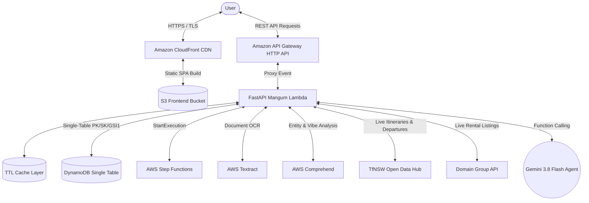

# SydLiving AI

[](https://fastapi.tiangolo.com)
[](https://react.dev)
[](https://www.typescriptlang.org)
[](https://tailwindcss.com)
[](https://ai.google.dev)
[](https://leafletjs.com)
[](https://opensource.org/licenses/MIT)

**SydLiving AI** is an AI-augmented property search and commute intelligence platform tailored for professionals, students, and expats relocating to Sydney, Australia.

Moving to Sydney often means balancing high rental costs against long, complex public transit commutes across Sydney Harbour, the Eastern Suburbs, and Greater Western Sydney. SydLiving AI demystifies Sydney housing by unifying **natural language property discovery**, **Transport for NSW (TfNSW) door-to-door transit matrices**, **interactive spatial commute reach isochrones**, and a **side-by-side shortlist comparison suite** in a single glassmorphic workspace.

---


---

## 🌟 Key Features

### 1. Dynamic Commute Reach & Multi-Tier Isochrones
Filter properties by door-to-door transit commute travel time to major Sydney employment hubs (Barangaroo, Central, Martin Place, Victoria Cross / North Sydney, Macquarie Park, and Parramatta).

- **Multi-Tier Reach Zones:** Visual isochrone rings dynamically render on the map for $\le$15m (green), $\le$30m (indigo), $\le$45m (purple), and $\le$60m (amber).
- **Transit Mode Transparency:** Every listing card displays verified door-to-door transit times, line details (Sydney Metro M1, Sydney Trains T1/T4, B-Line Express Buses, Sydney Ferries), and direct transfer indicators.
- **Interactive Commute Slider:** Drag the maximum commute slider to instantly filter matching properties and update map reach zones in real time.


---

### 2. Shortlist & Side-by-Side Commute Comparison
Compare shortlisted properties side-by-side to make confident rental decisions.

- **Financial Clarity:** View weekly rent paired with estimated monthly housing expenses.
- **Door-to-Door Commute Breakdown:** Compare travel minutes and transit lines to your selected workplace hub.
- **Opal Fare Projections:** Estimated weekly transit costs based on a standard 10-trip weekly commute.
- **Lifestyle Metrics:** Proximity to Sydney beaches (Bondi, Manly, Coogee, Bronte) and direct route transfers.
- **Map Synchronization:** Jump directly from the comparison modal to highlight any property on the interactive map.


---

### 3. Conversational AI Relocation Assistant
Powered by **Google Gemini 3.8 Flash** with native function calling, the assistant consults on Sydney suburbs, rent affordability, and public transit connectivity.

- **Tool Execution:** Automatically calls backend tools (`query_properties`, `get_commute`, `filter_by_commute_reach`) to query listings and transit matrices.
- **Multi-Option Trade-Off Engine:** Agent synthesizes 2–3 clearly labelled trade-offs (🏷️ Cheapest, ⏱️ Fastest Commute, ⭐ Best Overall) balancing budget against transit friction.
- **Live UI Synchronization:** AI recommendations immediately update map bounds, active hub filters, and listing results.
- **Curated Prompt Suggestions:** One-tap chips for newcomer queries like *"Show rentals under 25 mins to Barangaroo"*, *"Metro-connected 2BR under $850/wk"*, and *"Compare commute from Manly vs Bondi Beach"*.

---

### 4. Real Data Integrations & Caching Layer
- **Transport for NSW (TfNSW) Trip Planner API:** Real door-to-door transit itineraries, line departures, and transfer counts via the Open Data Hub.
- **Domain Group Developer API:** Authentic Sydney rental listings and suburb suggestions.
- **Resilient TTL Caching:** Automated in-memory caching for transit routes (30 min), property queries (60 min), and station departures (5 min).

---

### 5. AWS Tenancy & Inspection Lease Auditor
Serverless lease contract analysis extracting text and key facts with **AWS Textract**, running entity extraction with **AWS Comprehend**, and executing a specialized NSW Tenancy Red Flag Rule Engine (detecting illegal bond ratios >4 weeks, missing Rental Bonds Online lodgement, unlawful break-lease penalties, and excessive rent review clauses).

---

## 🏗️ Architecture

The application is architected as a modern, local-first full-stack system with seamless serverless AWS production deployment:

- **Backend:** FastAPI (Python 3.11+), Pydantic v2, Mangum ASGI Lambda adapter (`backend/lambda_handler.py`)
- **Persistence Store:**
  - **AWS DynamoDB Single-Table Design (`SydLiving-Core`):** Production persistence with On-Demand billing, point-in-time recovery, and Global Secondary Index (`GSI1`) supporting atomic transactions, property queries by suburb/rent, favorites, alerts, and sessions.
  - **SQLite Local Fallback (`sydliving.db`):** Zero-friction local development without AWS account prerequisites.
- **External Real-Time APIs:**
  - **Transport for NSW (TfNSW) Open Data Hub:** Trip Planner API (`/stop_finder`, `/trip`, `/departure_mon` endpoints).
  - **Domain Group Developer API:** "Agencies & Listings" and "Properties & Locations" packages.
- **Caching Layer:** High-performance thread-safe TTL Cache (`backend/cache.py`) preventing duplicate external API calls with hit-rate monitoring.
- **Frontend:** React 19, Vite, TypeScript, Tailwind CSS v4, React-Leaflet
- **AI Agent:** Google Gemini (`gemini-3.8-flash`) with function calling and multi-turn chat sessions
- **Cloud & Serverless Ready:**
  - Python 3.11 Lambda ASGI adapter (`backend/lambda_handler.py`).
  - AWS Step Functions state machine orchestrator (`backend/statemachine/property_orchestrator.asl.json`).
  - Dual-mode database compatibility (local SQLite or AWS DynamoDB single-table schema).



---

## 🚀 Development Setup

### Prerequisites
- Python 3.11+
- Node.js (v18+) & npm

### 1. Database Setup & Data Seeding
Generate the SQLite database and seed it with Sydney destination hubs, property listings, and transit commute matrices:

```bash
cd backend

# Create and activate virtual environment
python3 -m venv venv
source venv/bin/activate

# Install backend dependencies
pip install -r requirements.txt

# Seed the database
python3 seed.py
```
*Creates `sydliving.db` containing 6 destination hubs, 75+ Sydney property listings with photos, and door-to-door commute matrices.*

### 2. Environment Configuration
Create a `.env` file in `backend/`:

```env
# Google Gemini API Key for conversational AI agent
GEMINI_API_KEY=your_gemini_api_key_here
GEMINI_MODEL=gemini-3.8-flash

# Transport for NSW Open Data Hub API Key (Optional: Graceful fallback active when absent)
TFNSW_API_KEY=your_tfnsw_api_key

# Domain Group Developer API Key (Optional: Graceful fallback active when absent)
DOMAIN_API_KEY=your_domain_api_key

# AWS Credentials (Optional: Local fallback active when absent)
AWS_ACCESS_KEY_ID=your_aws_access_key
AWS_SECRET_ACCESS_KEY=your_aws_secret_key
AWS_REGION=ap-southeast-2
PROPERTY_ORCHESTRATOR_SFN_ARN=arn:aws:states:ap-southeast-2:123456789012:stateMachine:SydLivingOrchestrator
```

### 3. Run FastAPI Backend

```bash
cd backend
uvicorn main:app --reload --port 8000
```
- API Base: `http://localhost:8000`
- Interactive Swagger Docs: `http://localhost:8000/docs`

### 4. Run React + Vite Frontend

```bash
cd frontend

# Install dependencies
npm install

# Start Vite dev server
npm run dev
```
The frontend application will be live at `http://localhost:5173`.

---

## 📡 API Endpoints Reference

| Method | Endpoint | Description |
|---|---|---|
| `GET` | `/api/health` | Service health check |
| `GET` | `/api/hubs` | Retrieve all Sydney destination CBD hubs |
| `GET` | `/api/properties` | Search properties with filters: `destination_hub`, `max_commute_mins`, `max_rent`, `min_bedrooms`, `circle`, `polygon` |
| `POST` | `/api/properties/semantic-search` | Search rentals using vector similarity over listing copy and suburb vibe metadata |
| `GET` | `/api/commute` | Lookup transit duration and route between `origin_suburb` and `destination_cbd_hub` via TfNSW Trip Planner |
| `GET` | `/api/departures` | Real-time upcoming station departures via TfNSW Departures API |
| `GET` | `/api/isochrones` | Commute reach suburbs within `max_minutes` of a `destination_hub` |
| `GET` | `/api/locations/suggest` | Suburb and address suggestions via Domain Properties & Locations |
| `POST` | `/api/chat` | Multi-turn conversational endpoint invoking Gemini agent with tool calling |
| `GET` | `/api/chat/sessions` | Fetch conversation history for authenticated user |
| `GET` | `/api/properties/saved` | Fetch saved/shortlisted properties |
| `POST` | `/api/properties/saved/{id}` | Toggle saved property |
| `POST` | `/api/lease/audit` | Upload lease PDF or paste agreement clauses for AWS Textract/Comprehend NSW statutory red flag analysis |
| `POST` | `/api/orchestrator/search` | Execute Step Functions orchestrated 4-step search pipeline |
| `GET` | `/api/heatmap` | Suburb commute-cost efficiency metrics ($/wk vs mins to CBD) |
| `GET` | `/api/cache/stats` | Live cache hits, misses, and active entry metrics |
| `POST` | `/api/cache/clear` | Invalidate all in-memory caches |

---

## ☁️ Cloud & Production Readiness

The application architecture includes serverless-ready components:
- **FastAPI Lambda Adapter:** Mangum ASGI adapter configured for AWS Lambda (`backend/lambda_handler.py`).
- **AWS Step Functions Pipeline:** Multi-step search workflow definition in Amazon States Language (`backend/statemachine/property_orchestrator.asl.json`).
- **DynamoDB Single-Table Schema:** Single-table persistence (`backend/dynamo_db.py`) and seeding tool (`backend/seed_dynamodb.py`).

Infrastructure as Code (CDK or Terraform) will be provisioned once AWS account access is established.

---

## 🧪 Testing

Run backend automated test suite:

```bash
cd backend
pytest tests -v
```

Run frontend linting & production build:

```bash
cd frontend
npm run build
```

---

## 📄 License
MIT License. Created for professionals relocating to Sydney, Australia.
