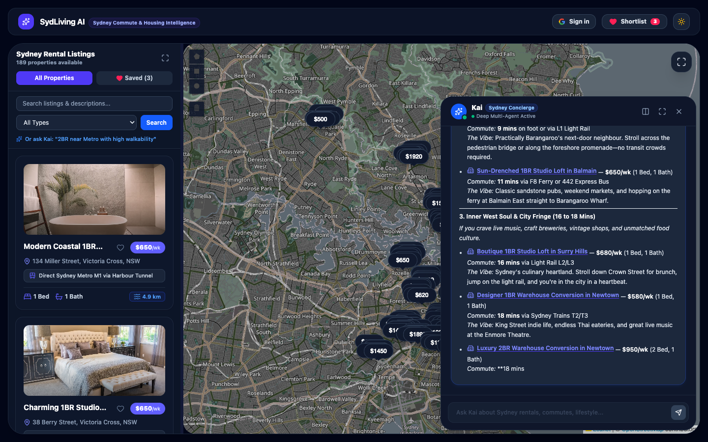
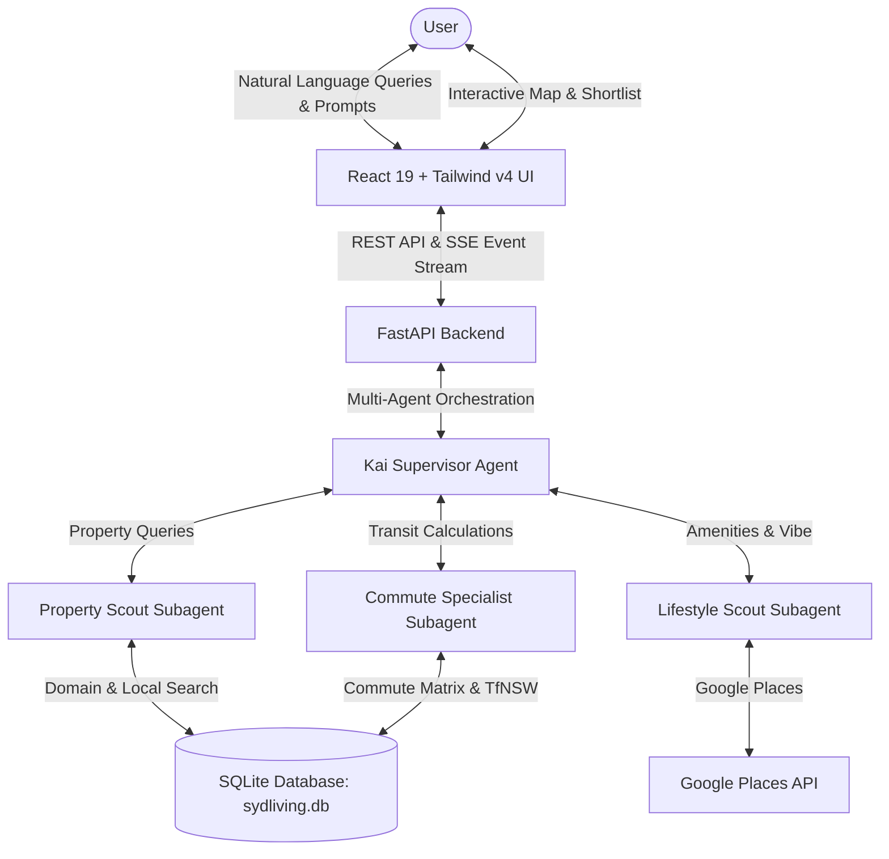

# SydLiving AI

[](https://fastapi.tiangolo.com)
[](https://react.dev)
[](https://www.typescriptlang.org)
[](https://tailwindcss.com)
[](https://ai.google.dev)
[](https://python.langchain.com)
[](https://leafletjs.com)
[](https://opensource.org/licenses/MIT)

**SydLiving AI** is an AI-augmented property discovery and commute intelligence platform tailored for professionals, students, and expats relocating to Sydney, Australia.

Moving to Sydney often means balancing steep rental markets against complex public transit commutes across Sydney Harbour, the Eastern Suburbs, and Greater Western Sydney. SydLiving AI demystifies Sydney housing by unifying **Kai — an authentic AI Living Concierge**, **LangChain Deep Multi-Agent orchestration**, **Transport for NSW (TfNSW) transit matrices**, and a **side-by-side shortlist comparison suite** in a single glassmorphic workspace.

---


---

## 🌟 Key Features

### 1. Kai — Sydney Living AI Concierge (Deep Multi-Agent Engine)
Meet **Kai**, Sydney's dedicated AI relocation concierge. Kai brings authentic local knowledge to your search—from morning sun angles, beach wind conditions, and cafe strips to door-to-door transit nuances across the **Sydney Metro M1**, **Light Rail (L1/L2/L3)**, **Sydney Ferries**, and **Express Buses**.

- **Multi-Agent Orchestration:** Powered by LangChain Deep Agents coordinating specialized subagents in parallel:
  - `property_scout`: Searches verified Domain listings and local rental data by budget and specs.
  - `commute_specialist`: Calculates transit schedules, transfer points, and door-to-door travel times.
  - `lifestyle_scout`: Investigates local cafes, gyms, beach proximity, and neighborhood vibe.
- **Real-Time Step Streaming:** Live visual activity log showing agent thoughts, subagent delegations, and stopwatch latency tracking.
- **Interactive In-App Property Linking:** Kai formats every property recommendation as a clickable `[Title](property:<id>)` link. Clicking any chip in chat immediately centers the listing on the map and opens its detail drawer.
- **Contextual Inquiry Cards:**
  - **Property Detail Drawer:** One-click "Ask Kai About This Home" chips covering commute breakdowns, beach lifestyle, rent fairness, and local dining, plus an inline question box.
  - **Shortlist Comparison:** "Ask Kai to Compare" presets that synthesize multi-property trade-offs.
- **Elevated Concierge Capsule & Greeting Bubble:** A prominent floating launcher featuring Kai's avatar with an active live pulse indicator and a dismissible proactive greeting bubble with one-click search chips.



---

### 2. Side-by-Side Shortlist & Living Cost Suite
Compare shortlisted properties side-by-side to make informed relocation decisions.

- **Financial Clarity:** View weekly rent alongside projected monthly housing obligations.
- **Door-to-Door Commute Breakdown:** Compare travel minutes and transit lines to major commercial centers.
- **Opal Transit Fare Estimates:** Estimated weekly transit expenses based on a standard 10-trip weekly commute.
- **Lifestyle Metrics:** Proximity to iconic beaches (Bondi, Manly, Coogee, Bronte, Clovelly) and transfer friction.
- **Ask Kai to Compare:** Instantly feeds your shortlisted homes to Kai for a comparative breakdown of transit convenience, neighborhood vibe, and total weekly living cost.


---

### 3. Clean Spatial Property Discovery (252+ Verified Rentals)
Explore a rich dataset of **252 verified rental listings** across **36 Sydney suburbs** spanning the Eastern Suburbs, Inner West, Lower North Shore, Northern Beaches, and Western Sydney.

- **Curated Photography:** 53 verified high-resolution architectural and interior photography assets paired with property archetypes.
- **Decluttered Map Canvas:** Fast, responsive Leaflet map with subtle dark/light price pins and smooth hover states.
- **Spatial Drawing Filters:** Draw custom circles or polygons directly on the map to bound property searches.
- **Natural Language Search Helper:** An organic `"Or ask Kai"` prompt helper embedded beneath search filters.

---

## 🏗️ Architecture

SydLiving AI is architected as a local-first, full-stack platform:

- **Backend:** FastAPI (Python 3.11+), Pydantic v2
- **Agent Framework:** LangChain Deep Agents with hierarchical multi-agent supervisor and subagents
- **AI Model:** Google Gemini (`gemini-3.8-flash`) via `langchain-google-genai` and Google GenAI SDK
- **Database:** SQLite (`sydliving.db` containing 252 properties and 216 commute matrix routes)
- **Frontend:** React 19, Vite, TypeScript, Tailwind CSS v4, Lucide Icons, React-Leaflet



---

## 🚀 Development Setup

### Prerequisites
- Python 3.11+
- Node.js (v18+ recommended)
- Git

### 1. Database Setup & Data Seeding
Generate the SQLite database and seed it with 252 Sydney property listings, destination hubs, and commute matrices:

```bash
cd backend

# Create and activate virtual environment
python3 -m venv venv
source venv/bin/activate

# Install backend dependencies
pip install -r requirements.txt

# Seed the database
python3 seed.py
```
*Creates `sydliving.db` containing 252 rental listings with curated Unsplash photography and 216 commute routes.*

### 2. Environment Configuration
Create a `.env` file in `backend/`:

```env
# Google Gemini API Key for conversational AI agent
GEMINI_API_KEY=your_gemini_api_key_here
GEMINI_MODEL=gemini-3.8-flash

# Optional: Domain Group API Key & Google Places API Key
DOMAIN_API_KEY=
GOOGLE_API_KEY=
```

### 3. Run FastAPI Backend

```bash
cd backend
uvicorn main:app --reload --port 8000
```
- API Base: `http://localhost:8000`
- Interactive Swagger Docs: `http://localhost:8000/docs`

### 4. Run React + Vite Frontend

```bash
cd frontend

# Install dependencies
npm install

# Start Vite dev server
npm run dev
```
The frontend application will be live at `http://localhost:5173`.

---

## 📸 Visual Assets & UI Verification Policy (Mandatory)

> [!IMPORTANT]
> **All future UI/UX modifications require updating the canonical documentation screenshots.**
> Whenever components, styling, or layouts are changed, you must regenerate the visual assets before opening or updating a Pull Request.

### Canonical Visual Assets:
1. `docs/screenshots/dark_mode_commute_map.png` — Main application canvas in dark mode showing map, 252 property listings, and Kai's Concierge Capsule with proactive greeting bubble.
2. `docs/screenshots/kai_ai_concierge_chat.png` — Active chat drawer showing Kai's multi-agent streaming responses, local advice, and property links.
3. `docs/screenshots/shortlist_compare_modal.png` — Shortlist comparison modal showing side-by-side properties and the "Ask Kai to Compare" action bar.

### Automated Screenshot Capture:
With both frontend (`npm run dev`) and backend (`uvicorn main:app`) running, execute:

```bash
./scripts/update_screenshots.sh
```

This automated Playwright script sets up dark mode, loads sample shortlists, interacts with Kai, and updates all three canonical screenshot assets in `docs/screenshots/`.

---

## 📡 API Endpoints Reference

| Method | Endpoint | Description |
|---|---|---|
| `GET` | `/api/health` | Service health check |
| `GET` | `/api/hubs` | Retrieve all Sydney destination CBD hubs |
| `GET` | `/api/properties` | Search properties with filters: `keyword`, `property_type`, `max_rent`, `min_bedrooms`, `circle`, `polygon` |
| `GET` | `/api/properties/{id}` | Retrieve individual property listing details |
| `GET` | `/api/properties/saved` | Fetch saved/shortlisted properties for authenticated user |
| `POST` | `/api/properties/saved/{id}` | Toggle saved property |
| `GET` | `/api/commute` | Lookup transit duration and route between `origin_suburb` and `destination_cbd_hub` |
| `POST` | `/api/chat/deep` | Streaming Server-Sent Events (SSE) endpoint for LangChain Deep Multi-Agent chat |
| `GET` | `/api/chat/sessions` | Fetch conversation history for authenticated user |
| `DELETE` | `/api/chat/sessions/{id}` | Delete a chat session |

---

## 🧪 Testing

Run backend automated test suite:

```bash
cd backend
pytest
```

Run frontend linting & production build:

```bash
cd frontend
npm run lint
npm run build
```

---

## 📄 License
MIT License. Created for professionals relocating to Sydney, Australia.
