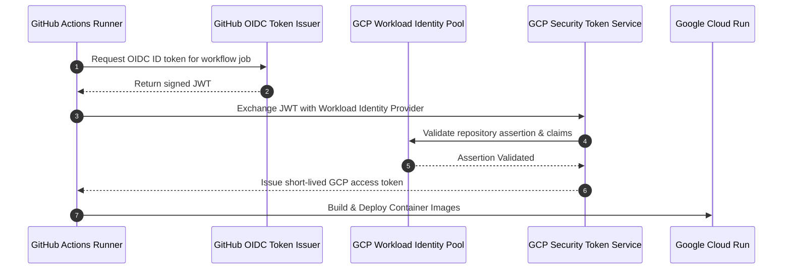

# GitHub Actions CI/CD Deployment Guide for SydLiving AI (GCP & Cloud Run)

This guide provides a detailed walkthrough for setting up automated Continuous Integration and Continuous Deployment (CI/CD) to Google Cloud Platform using **GitHub Actions** and **Workload Identity Federation (WIF)**.

---

## 1. Why Workload Identity Federation (WIF)?

Traditional CI/CD setups often export long-lived, high-privilege GCP Service Account JSON keys and store them in GitHub Secrets. This is a recognized security risk (keys can leak, expire, or get mismanaged).

With **Workload Identity Federation**:
- No GCP private keys are ever created or stored in GitHub.
- GitHub Actions mints a short-lived OIDC JSON Web Token (JWT) signed by GitHub.
- Google Cloud verifies the cryptographic token directly and exchanges it for a short-lived (1-hour) Google OAuth access token.
- Access is strictly restricted to your exact GitHub repository (`assertion.repository == 'owner/repo'`).



---

## 2. Step-by-Step Setup Walkthrough

### Step 1: Provision WIF & Infrastructure with Terraform

The Terraform configuration includes Workload Identity Federation out of the box in `terraform/github_actions.tf`.

1. Open `terraform/terraform.tfvars`:
   ```hcl
   project_id   = "your-gcp-project-id"
   region       = "australia-southeast1"
   github_repo  = "amcguinness056/SydLiving-AI" # Your GitHub owner/repo
   ```

2. Run `terraform apply`:
   ```bash
   cd terraform
   terraform apply
   ```

3. Note the two outputs displayed at the end of the apply:
   ```text
   github_workload_identity_provider = "projects/1234567890/locations/global/workloadIdentityPools/sydliving-github-pool/providers/github-provider"
   github_actions_service_account    = "sydliving-gh-deployer@your-gcp-project-id.iam.gserviceaccount.com"
   ```

---

### Step 2: Configure GitHub Repository Secrets & Variables

Navigate to your GitHub repository in your browser:
**Settings** > **Secrets and variables** > **Actions**

#### Add Repository Variables (`Variables` tab):
Click **New repository variable**:

| Name | Example Value | Description |
|---|---|---|
| `GCP_PROJECT_ID` | `your-gcp-project-id` | Your GCP Project ID |
| `GCP_REGION` | `australia-southeast1` | Deployment region (defaults to Sydney) |

#### Add Repository Secrets (`Secrets` tab):
Click **New repository secret**:

| Name | Value | Description |
|---|---|---|
| `GCP_WORKLOAD_IDENTITY_PROVIDER` | `projects/1234567890/locations/global/workloadIdentityPools/sydliving-github-pool/providers/github-provider` | The `github_workload_identity_provider` output from Terraform |
| `GCP_SERVICE_ACCOUNT` | `sydliving-gh-deployer@your-gcp-project-id.iam.gserviceaccount.com` | The `github_actions_service_account` output from Terraform |

---

### Step 3: Inspect the Workflow File

The workflow is located at `.github/workflows/deploy.yml`:
- **Triggers**:
  - Automatically triggers when code is pushed to `main` with changes in `backend/`, `frontend/`, or `.github/workflows/`.
  - Can also be triggered manually via the **Run workflow** button on GitHub (**Actions** tab).
- **Execution Flow**:
  1. Requests GitHub OIDC token (`id-token: write`).
  2. Authenticates to GCP via `google-github-actions/auth@v2`.
  3. Builds backend container with Docker Buildx and pushes to Google Artifact Registry.
  4. Deploys the backend container to Cloud Run and captures its generated public HTTPS URL.
  5. Injects the backend URL into the frontend build via `--build-arg VITE_API_URL=${BACKEND_URL}`.
  6. Builds the frontend React + Nginx container and pushes to Artifact Registry.
  7. Deploys the frontend container to Cloud Run.
  8. Emits a deployment summary with clickable live URLs in the GitHub Actions run summary.

---

### Step 4: Test & Trigger Deployment

To test the deployment:

1. Commit and push the new workflow files to GitHub:
   ```bash
   git add .
   git commit -m "feat: configure GCP Cloud Run deployment via GitHub Actions"
   git push origin gcp_iac_deployment
   ```
2. When merged to `main` (or run manually via **Actions** > **Deploy SydLiving AI to GCP Cloud Run** > **Run workflow**), watch the job progress.
3. Once completed, the workflow outputs the live URLs:
   - Backend API URL: `https://sydliving-backend-xyz-ts.a.run.app`
   - Frontend Web URL: `https://sydliving-frontend-xyz-ts.a.run.app`

---

## 3. How Changes and Rollbacks Work

- **Zero Downtime Deployments**: Cloud Run performs progressive traffic migration to new revisions. If a new container fails health checks, traffic remains on the previous working revision.
- **Rollbacks**: You can instantly revert to a previous revision in the Google Cloud Console (Cloud Run > Revisions > Manage Traffic) or trigger GitHub Actions on an older commit.
- **Fast Build Caching**: Docker layers are cached via GitHub Actions Cache (`actions/cache@v4`), making repeat builds take under 60 seconds.

---

## 4. Troubleshooting

### Error: `Subject in token does not match attribute condition`
- **Cause**: The GitHub repository sending the token does not match `var.github_repo` in Terraform.
- **Solution**: Ensure `github_repo` in `terraform.tfvars` exactly matches `owner/repo` (case-sensitive) on GitHub.

### Error: `google-github-actions/auth failed: token exchange failed`
- **Cause**: The `GCP_WORKLOAD_IDENTITY_PROVIDER` secret is incorrect, or the identity pool is still provisioning.
- **Solution**: Verify the provider string using `terraform -chdir=terraform output github_workload_identity_provider`.

### Error: `Permission denied on resource ...`
- **Cause**: The CI/CD Service Account (`sydliving-gh-deployer`) lacks necessary IAM roles.
- **Solution**: Re-run `terraform apply` to ensure `roles/run.admin`, `roles/artifactregistry.writer`, and `roles/iam.serviceAccountUser` are attached.
